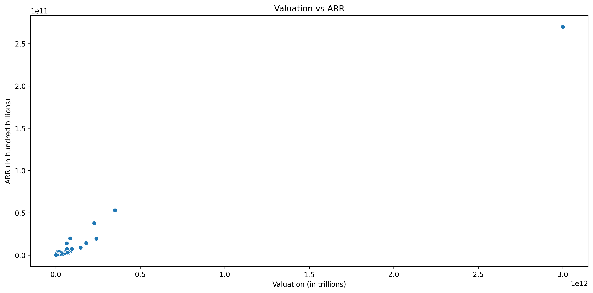
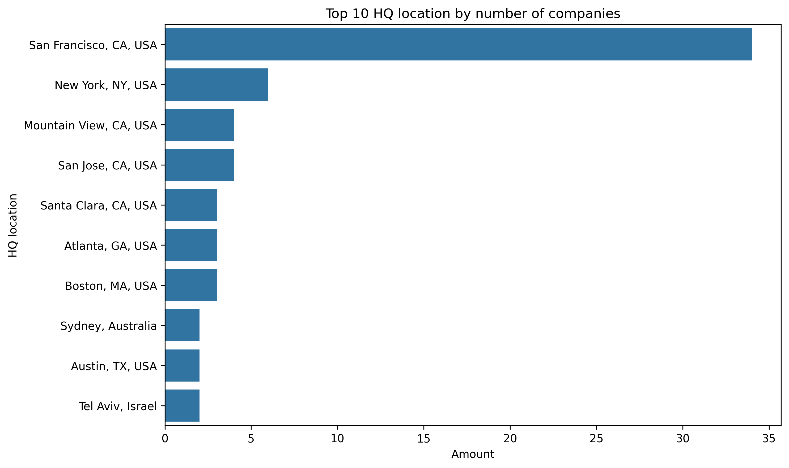
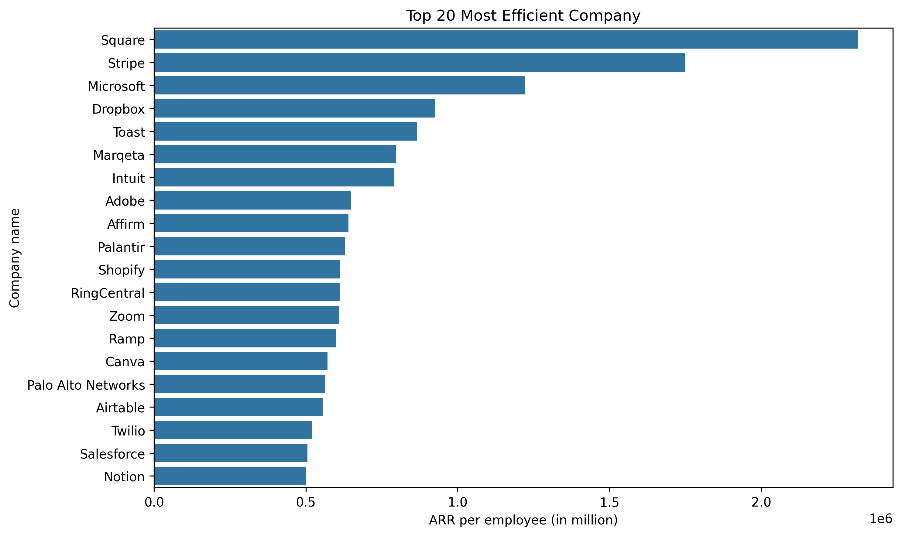
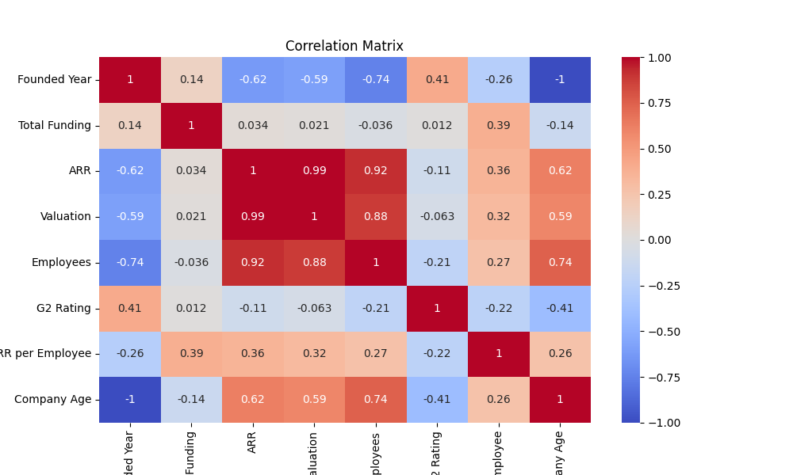

# 🚀 Top 100 SaaS Companies - 2025 | Data Analysis

This project explores trends and patterns in the **Top 100 SaaS Companies of 2025** using real-world startup data. It includes data cleaning, exploratory data analysis (EDA), and visual storytelling to extract business and tech insights.

## 📊 Dataset Overview

- **Source**: 
- **Rows**: 100 companies
- **Columns**: Company Name, Founded Year, HQ, Industry, ARR (Annual Recurring Revenue), Valuation, Funding, Employees, and more.

## 📌 Key Questions Explored

- Which industries have the highest average ARR?
- What are the top SaaS HQ locations?
- Who are the most efficient companies (ARR per employee)?
- Is there a correlation between funding, ARR, and valuation?

## 📈 Visual Highlights

Here are some of the plots from the project (more in `visualizations/`):

### 🔗 ARR vs Valuation

### 🌍 Top HQ Locations

### 💡 Industry Efficiency

### 📉 Correlation Matrix

## 🔍 Notebooks

- [`cleaning_data.ipynb`](notebook/cleaning_data.ipynb): Raw → Clean dataset
- [`eda.ipynb`](notebook/eda.ipynb): Full EDA process, visualizations, insights

## 🧠 Key Insights

- Enterprise software companies dominate in ARR
- San Fransisco remains the top HQ location
- High valuation doesn’t always mean high ARR or efficiency
- Some niche players are outperforming unicorns in ARR/employee

## 🧰 Tech Stack

- Python: `pandas`, `numpy`, `matplotlib`, `seaborn`
- Jupyter Notebooks for code + visuals
- Markdown & GitHub for publishing

## 🚀 Future Ideas

- Build a Streamlit dashboard for interactive exploration
- Add ML model to predict future top performers
- Time-series analysis if historical data is available

## 🙋 About Me

**Deny Pratama** — Tech Enthusiast & Data Science Student  
📍 Indonesia | 🌐 Learning Golang, Python, and data for Business, Finance, and AI  
🐙 [GitHub](https://github.com/denypratamas)

---

> ⭐ Feel free to fork or star if you find it useful — always open to feedback & collabs!
